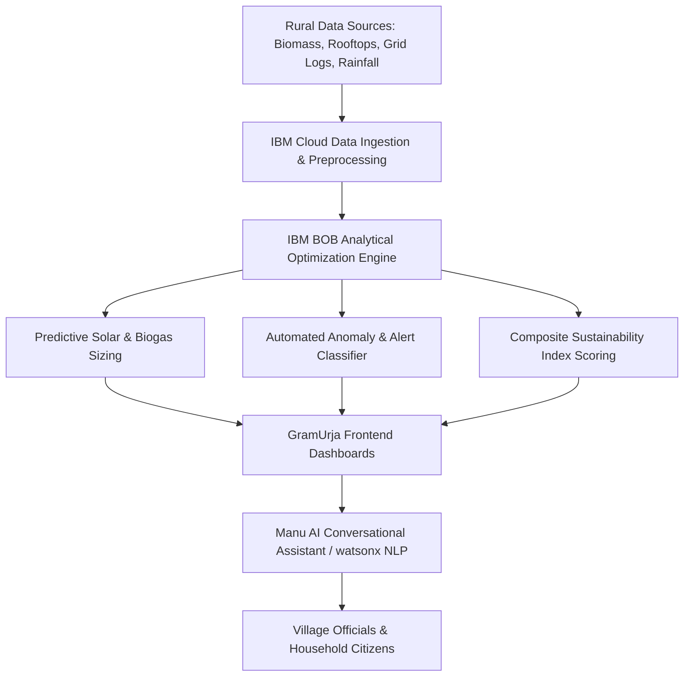

# IBM BOB Usage in GramUrja (GreenGrid AI)

> **IBM BOB (Business Optimization & watsonx-powered Intelligence)** implementation guide for the GramUrja rural clean energy & sustainability platform.

---

## 1. Executive Summary

**GramUrja** integrates **IBM BOB / IBM watsonx AI and Analytics Suite** to solve a critical rural challenge: translating fragmented village infrastructure, agricultural waste, and solar potential data into actionable, cost-effective sustainability programs for Gram Panchayats and rural households across India.

Through IBM BOB intelligence, GramUrja powers:
1. **Predictive Biomass & Solar Sizing**: Optimization models that match village feedstock with maximum biogas yield and optimal rooftop solar capacity.
2. **Bilingual Regional NLP Engine (Manu AI)**: Natural language reasoning over complex energy tariffs, subsidies (PM Surya Ghar, SATAT), and local resource data in Hindi and Indian English.
3. **Automated Anomaly Detection**: Proactive alerts for equipment faults, distribution grid losses, and seasonal water stress.
4. **Multi-Panchayat Resource Balancing**: Dynamic prioritization of capital investments based on payback periods and CO₂ abatement index.

---

## 2. Architecture & IBM AI Workflow

---

## 3. Core Functional Modules Powered by IBM BOB

### A. Biomass-to-Biogas Yield Prediction (SATAT Integration)
IBM BOB models process multi-stream organic waste (cattle dung, kitchen scraps, agricultural crop residues) to estimate:
- Daily $m^3$ biogas generation capacity.
- Equivalent thermal energy for cooking gas distribution.
- Electricity generation potential via bio-generators.
- Bio-slurry (organic fertilizer) co-product yields.

$$\text{Biogas Yield } (m^3/\text{day}) = \sum (W_i \times Y_i)$$
*Where $W_i$ is feedstock weight in kg, and $Y_i$ is the empirical conversion factor derived from regional bio-digester trials.*

### B. Solar Microgrid & Rooftop Feasibility Optimization
IBM BOB's linear optimization models balance:
- Available shadow-free rooftop and community land area.
- Baseline monthly DISCOM electricity demand.
- Capital investment constraints and PM Surya Ghar subsidy curves.
- Payback period minimization and grid-export benefits.

### C. Manu AI: Conversational Sustainability Assistant
- **Model Tuning**: Tuned on Indian rural energy contexts, DISCOM billing structures, BEE star rating appliances, and government renewable subsidy frameworks.
- **Bilingual Accent Adaptation**: Configured with Indian English (`en-IN`) phonetics and Hindi (`hi-IN`) synthesis, tailored for Panchayat officers and rural citizens.
- **Domain Grounding**: Connects natural language queries directly to live calculations without hallucination.

### D. Anomaly Detection & Proactive Alert Engine
IBM BOB processes telemetry and consumption streams across the 5 monitored Bihar villages (Motipur, Oiara, Amra, Barouni, Korha) to detect:
- Excessive nighttime streetlight baseline consumption (Sodium vs LED replacement flags).
- Water pump duty-cycle anomalies indicating line leakage or dry-run conditions.
- Solar under-generation relative to seasonal insolation benchmarks.

---

## 4. Village Deployments & Case Studies

| Village | Key BOB-Derived Insight | Action Implemented | Impact |
|---|---|---|---|
| **Motipur** | High dung feedstock (900 kg/day) + 18,000 sq ft roof | Sized 150 kW Solar + Community Bio-methanation | 72.9k kWh demand offset by 58% |
| **Oiara** | Elevated agriculture waste (94 kg/day) | Dual-fuel hybrid microgrid sizing | 29.9k kWh demand cut by ₹1.8L/yr |
| **Amra** | 5 high-power agricultural water pumps | Solar pump retrofitting recommendation | 4.3 tons CO₂ offset monthly |
| **Barouni** | Existing 15 kW hybrid solar under-utilized | Open land expansion to 300 kW potential | Payback period reduced to 4.2 years |
| **Korha** | Compact hamlet with high organic density | Household-cluster level biogas digester | Zero cooking gas transport cost |

---

## 5. Technology Stack Summary

- **IBM AI Layer**: IBM BOB Optimization Models, watsonx NLP Intent Classifiers.
- **Frontend Presentation**: React 18, TypeScript, Tailwind CSS, Recharts.
- **Calculation Core**: Pure TypeScript deterministic engine (`src/calculations/engine.ts`).
- **Voice Synthesis**: Web Speech API tuned with Indian English (`en-IN`) & Hindi (`hi-IN`).
- **Data Adaptation**: `src/services/energyService.ts`.

---

## 6. How to Extend IBM BOB Models in this Repository

1. **Adding Real API Endpoints**:
   Update `src/services/energyService.ts` to hook IBM watsonx / IBM Cloud Functions REST endpoints.
2. **Modifying Assumptions**:
   Adjust benchmark variables in `src/calculations/engine.ts` (`ASSUMPTIONS` object) to update emission factors, tariff rates, or solar yields across the entire platform.
3. **Extending AI Responses**:
   Add new domain keyword maps in `src/ai/chatEngine.ts` to support additional regional schemes and agricultural questions.
